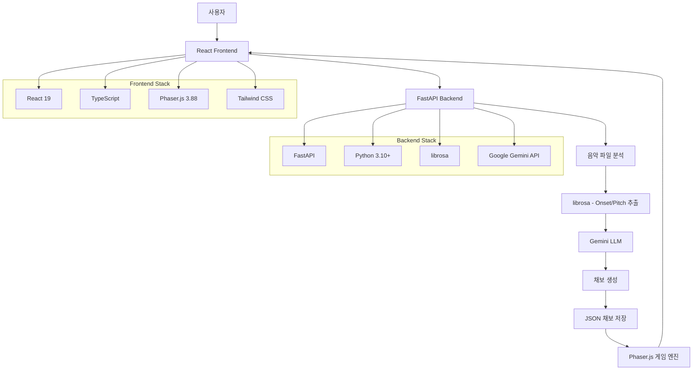
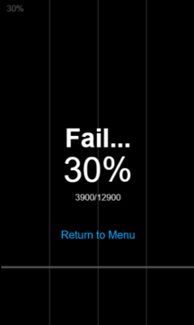
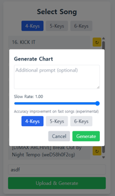

# 🎵 AnyRythm - AI-Powered Rhythm Game

> **"누구나, 자신이 좋아하는 음악으로, 쉽게 그리고 재미있게 리듬게임을 즐길 수 있어야 한다."**

HCI 프로그래밍 과목에서 LLM 활용을 중점으로 개발한 리듬게임 프로젝트입니다. 사용자가 업로드한 음악 파일을 분석하여 AI가 자동으로 채보를 생성하고, 실시간으로 플레이할 수 있는 웹 기반 리듬게임입니다.

## 🎯 프로젝트 비전

이 프로젝트는 네 가지 핵심 요소로 구성됩니다:

- **🎵 Play Any Song**: MP3/WAV 파일을 업로드하면 바로 게임에서 플레이 가능
- **🤖 Auto-Generated Charts**: 음악 이론 지식 없이도 LLM이 자동으로 채보 생성
- **🎮 Fun & Playable**: 실제로 재미있게 플레이할 수 있는 고품질 채보 제공
- **👤 User-Centered**: 사용자가 자신의 음악으로 직접 플레이 경험을 '공동 창작'

## 🏗️ 시스템 아키텍처



## 🚀 주요 기능

### 🎵 음악 업로드 및 분석
- MP3/WAV 파일 업로드 지원
- librosa를 활용한 음악 분석 (onset, pitch 추출)
- 템포 조절 기능으로 빠른 곡도 정확히 인식

### 🤖 AI 채보 생성
- Google Gemini 2.0/2.5 모델 활용
- 음악 분석 데이터와 사용자 프롬프트를 결합한 채보 생성
- 패턴 커스터마이징 (계단, 트릴, 특정 레인 제한 등)

### 🎮 게임 플레이
- Phaser.js 기반 실시간 리듬게임
- 4/5/6키 모드 지원
- 실시간 점수 시스템 및 기록 저장
- 게임 속도 조절 및 볼륨 제어

### 🎨 사용자 인터페이스
- 직관적인 노래 선택 화면
- 실시간 게임 플레이 인터페이스
- 디버그 메뉴 및 프롬프트 테스트 기능

## 🛠️ 기술 스택

### Frontend
- **React 19** - UI 프레임워크
- **TypeScript** - 타입 안전성
- **Phaser.js 3.88** - 게임 엔진
- **Tailwind CSS** - 스타일링
- **Vite** - 빌드 도구

### Backend
- **FastAPI** - 웹 API 프레임워크
- **Python 3.10+** - 백엔드 언어
- **librosa** - 음악 분석
- **Google Gemini API** - LLM 채보 생성
- **uvicorn** - ASGI 서버

## 🎓 LLM 활용 경험

### 개발 과정에서의 LLM 활용
이 프로젝트는 웹 개발 경험이 전무한 상태에서 시작되었습니다. **GPT-4**와 **Gemini**를 페어 프로그래밍 파트너로 활용하여:

- **FastAPI** 백엔드 구조 설계 및 구현
- **React + TypeScript** 프론트엔드 개발
- **Phaser.js** 게임 엔진 통합
- 음악 분석 및 LLM 연동 로직 구현

### LLM의 한계와 교훈
- **구조적 사고의 중요성**: LLM은 구현은 잘하지만 시스템 설계에서는 명확한 지시가 필요
- **인간적 요소의 한계**: '재미'라는 감각적 요소는 결국 사람의 창의적 개입이 필수
- **모델 성능 차이**: Gemini 2.5가 2.0보다 훨씬 더 재미있고 완성도 있는 채보 생성

### 성과
- 초기 목표의 **75-80% 달성**
- 웹 개발 전 분야를 3개월 만에 습득
- 실제 플레이 가능한 리듬게임 완성

## 🚀 실행 방법

### 0. 사전 요구사항
- Python 3.10+
- Node.js 18+

### 1. 환경 설정
```bash
# Backend 환경 설정
cd backend
python -m venv .venv
.venv\Scripts\activate  # Windows
# source .venv/bin/activate  # macOS/Linux
pip install -r requirements.txt

# .env 파일 생성
echo "GOOGLE_API_KEY=your_gemini_api_key_here" > .env
```

### 2. Backend 실행
```bash
cd backend
uvicorn main:app --reload
```

### 3. Frontend 실행
```bash
cd frontend
npm install
npm run dev
```

### 4. 접속
- Frontend: http://localhost:5173
- Backend API: http://localhost:8000

## 📁 프로젝트 구조

```
HCI_Project/
├── backend/                 # FastAPI 백엔드
│   ├── main.py             # 메인 API 서버
│   ├── uploads/            # 업로드된 음악 파일
│   ├── charts/             # 생성된 채보 JSON
│   └── songs.json          # 곡 목록 데이터
├── frontend/               # React 프론트엔드
│   ├── src/
│   │   ├── components/     # React 컴포넌트
│   │   ├── scenes/         # Phaser 게임 씬
│   │   ├── types/          # TypeScript 타입 정의
│   │   └── utils/          # 유틸리티 함수
│   └── package.json
└── readme.md
```

## 🎮 사용법

1. **음악 업로드**: 메인 화면에서 "Upload Song" 버튼 클릭
2. **채보 설정**: 추가 프롬프트와 키 수 선택 (4키/6키)
3. **게임 플레이**: 생성된 채보로 리듬게임 플레이
4. **커스터마이징**: 특정 패턴 요청으로 개인화된 채보 생성

## 🖼️ 프로젝트 스크린샷


### 게임 플레이 화면


### 업로드 및 설정 화면


## 🚀 라이브 데모

> **데모 서버**: []() *(서버 상태에 따라 접속 불가능할 수 있습니다)*

### 데모 사용 가이드
1. 위 링크로 접속하여 메인 메뉴 확인
2. 기존 업로드된 곡 중 하나를 선택하여 플레이
3. "Upload Song" 버튼을 클릭하여 새 음악 업로드
4. 추가 프롬프트로 채보 커스터마이징 체험

### 데모에서 체험할 수 있는 기능
- ✅ 음악 파일 업로드 (MP3/WAV)
- ✅ AI 채보 자동 생성
- ✅ 실시간 리듬게임 플레이
- ✅ 패턴 커스터마이징
- ✅ 점수 시스템 및 기록 저장

## 🔧 주요 API 엔드포인트

- `POST /upload` - 음악 파일 업로드 및 채보 생성
- `GET /songs` - 등록된 곡 목록 조회
- `GET /charts/{song_id}` - 특정 곡의 채보 데이터 조회
- `GET /uploads/{filename}` - 음악 파일 스트리밍

## 📊 프로젝트 통계

- **개발 기간**: 2주
- **지원 파일 형식**: MP3, WAV
- **지원 게임 모드**: 4/5/6키
- **LLM 모델**: Google Gemini 2.0/2.5

## 🏆 프로젝트 성과/회고

- **기간/범위**: 약 2주 동안 과목 프로젝트로 구현. 기본 업로드 → 분석 → LLM 채보 생성 → 플레이까지 동작하는 최소기능제품(MVP)을 완성.
- **기술 학습**: 웹 개발이 익숙하지 않은 상태에서 FastAPI, React(+Phaser) 기본기를 익혀 동작 가능한 흐름을 만들었음.
- **LLM 활용**: 프롬프트에 따라 채보 품질이 크게 달라짐을 경험. 특정 패턴(예: 계단/트릴/지정 레인) 요청은 반영되지만, ‘재미’의 일관성은 한계가 있었음.
- **한계/개선점**: 오디오-노트 동기 정밀도, 난이도 조절, 반복 패턴 감소, 채보 검수/편집 도구 부재가 아쉬움.
- **교훈**: LLM은 구현 보조에 유용하지만, 게임성(재미·리듬 감각)은 사람의 설계가 여전히 중요.


## 📝 기타

이 프로젝트는 HCI 프로그래밍 과목의 교육 목적으로 개발되었습니다.

---

**개발자**: 김승우
**과목**: HCI 프로그래밍 (LLM 활용 중심)  
**기간**: 2024년 1학기

